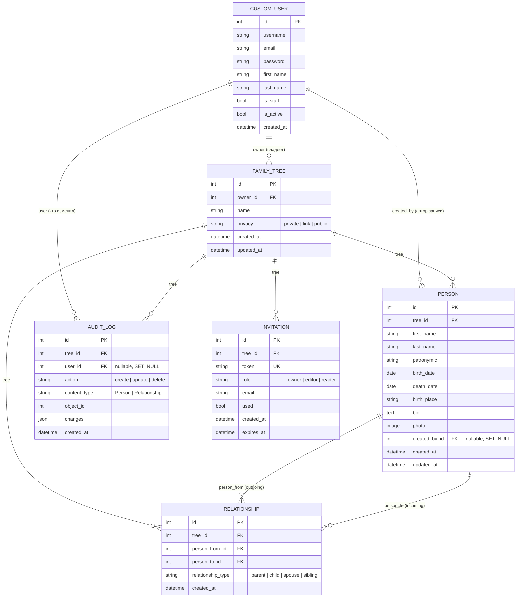

# ER-диаграмма базы данных (FamilyTree backend)

Сгенерировано по фактическим моделям Django (`users/models.py`, `trees/models.py`, состояние на 2026-07-01).
Открывается как обычный Mermaid-диаграмма — GitHub, GitLab и VS Code (расширение Markdown Preview Mermaid) рендерят её автоматически.



## Пояснения к связям

- **CustomUser → FamilyTree** (1 ко многим): один пользователь может владеть несколькими деревьями. Владелец = единственный, кто сейчас имеет доступ (`FamilyTreeViewSet.get_queryset` фильтрует `owner=request.user`).
- **FamilyTree → Person / Relationship / AuditLog / Invitation** (1 ко многим): всё живёт внутри дерева, при удалении дерева каскадно удаляется (`on_delete=CASCADE`).
- **Person → Relationship**: связь моделируется как направленное ребро графа (`person_from` → `person_to`) с типом (`parent/child/spouse/sibling`), а не как обычное дерево через `parent_id`. Это позволяет хранить супругов/братьев-сестёр, но требует ручной логики построения иерархии на бэкенде или фронте.
- Уникальность `(person_from, person_to, relationship_type)` не даёт задублировать одну и ту же связь.

## Известные пробелы в модели (см. также TODO в коде)

1. **Нет модели `TreeMember`** — роли `editor`/`reader` объявлены (в `CustomUser.ROLES` и `Invitation.role`), но нигде не хранится, кто из приглашённых имеет доступ к какому дереву и с какой ролью. `accept_invite` сейчас просто помечает инвайт использованным, доступ не выдаёт. Для соответствия ТЗ (роли, совместное редактирование) нужна таблица вида:
   ```
   TREE_MEMBER { id PK, tree_id FK, user_id FK, role, created_at }
   ```
2. **Нет tenant-изоляции на уровне БД для приглашённых** — сейчас изоляция работает только "owner видит только свои деревья", что не то же самое, что multi-tenant доступ для editor/reader.
3. **ТЗ упоминает JSONB для гибких анкетных полей** — в текущей модели `Person` все поля жёстко заданы (first_name, last_name и т.д.), JSONB-поля для произвольных атрибутов не предусмотрены.
4. **Нет модели для timeline-событий** (п. 2.3 ТЗ — "хронология жизни") — сейчас есть только `bio` (текстовое поле) и `photo` (одно фото на человека), а не набор архивных фото/документов на профиль.
