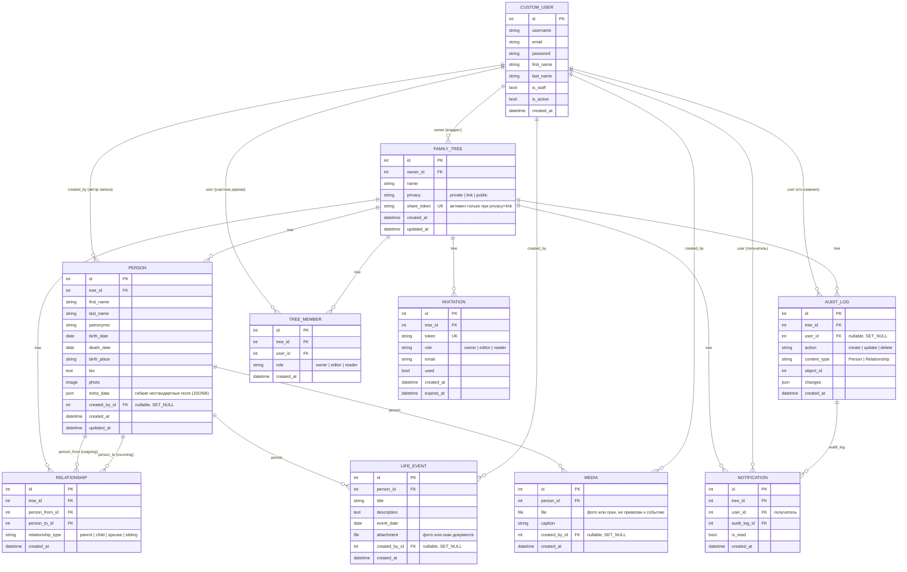

# ER-диаграмма базы данных (FamilyTree backend)

Сгенерировано по фактическим моделям Django (`users/models.py`, `trees/models.py`, состояние на 2026-07-02, после миграций `trees.0002_treemember`, `trees.0003_person_extra_data_lifeevent`, `trees.0004_familytree_share_token`, `trees.0005_notification` и `trees.0006_media`).
Открывается как обычный Mermaid-диаграмма — GitHub, GitLab и VS Code (расширение Markdown Preview Mermaid) рендерят её автоматически.

## Пояснения к связям

- **CustomUser → FamilyTree** (1 ко многим): `owner` — исторический "главный" владелец дерева (нужен, например, чтобы знать, кого нельзя разжаловать). Реальный доступ и права теперь определяются через `TreeMember`, а не напрямую через это поле.
- **TreeMember** — таблица доступа: кто из пользователей состоит в каком дереве и с какой ролью (`owner/editor/reader`). `unique_together(tree, user)` — у пользователя одна роль на дерево. При создании дерева владельцу автоматически создаётся запись с `role=owner`; при принятии инвайта (`accept_invite`) создаётся/обновляется запись с ролью из инвайта. Все вьюсеты (`FamilyTreeViewSet`, `PersonViewSet`, `RelationshipViewSet`) фильтруют доступ через эту таблицу, а не через `owner`.
- **FamilyTree → Person / Relationship / AuditLog / Invitation / TreeMember** (1 ко многим): всё живёт внутри дерева, при удалении дерева каскадно удаляется (`on_delete=CASCADE`).
- **Person → Relationship**: связь моделируется как направленное ребро графа (`person_from` → `person_to`) с типом (`parent/child/spouse/sibling`), а не как обычное дерево через `parent_id`. Это позволяет хранить супругов/братьев-сестёр, но требует ручной логики построения иерархии на бэкенде или фронте.
- Уникальность `(person_from, person_to, relationship_type)` не даёт задублировать одну и ту же связь.
- **Person.extra_data** (JSONField → в Postgres это колонка `jsonb`): гибкое хранилище нестандартных анкетных полей (профессия, национальность и т.п.), которые не у каждой семьи одинаковые. Не требует миграции при добавлении нового произвольного поля.
- **Person → LifeEvent** (1 ко многим): хронология жизни — отдельная таблица, а не поле в `Person`. Это намеренно: `full_tree` (граф для фронтенда) отдаёт только компактный `PersonSerializer` без событий, а `LifeEvent` подгружается отдельным запросом `GET /api/trees/{tree_id}/persons/{person_id}/life-events/` — так соблюдается требование ТЗ про ленивую загрузку детальной информации о профилях (п. 3.1).
- **FamilyTree.privacy + share_token**: `privacy` теперь реально управляет доступом на чтение (не только хранится как метка). `private` — только участники (`TreeMember`); `public` — читает любой авторизованный пользователь, даже не участник; `link` — читает любой авторизованный пользователь, если передаст верный `share_token` (например, `GET /api/trees/4/?share_token=...`). Во всех трёх случаях **запись** (создание/изменение persons, relationships, life-events, настроек дерева) разрешена только реальным `TreeMember` с ролью `owner`/`editor` — privacy расширяет только чтение, не права редактирования. `audit_log` не подчиняется privacy — доступен только участникам, даже если дерево публичное.
- **Список деревьев (`GET /api/trees/`) отдаёт `FamilyTreeListSerializer`**, а не `FamilyTreeDetailSerializer` — только `id/name/persons/relationships` не включены. Это осознанное изменение формы ответа (было: каждый элемент списка содержал вложенные `persons`/`relationships`) — вложенные данные остаются только в `retrieve` (`GET /api/trees/{id}/`) и в `full_tree`. Если фронтенд уже ожидает `persons`/`relationships` в списке — нужно переключить его на `full_tree` для конкретного дерева.
- **`GET /api/trees/{tree_id}/persons/{id}/ancestors/` и `.../descendants/`** — иерархия предков/потомков конкретного человека, посчитанная одним рекурсивным SQL-запросом (`WITH RECURSIVE` по таблице `Relationship`, только строки с `relationship_type='parent'`), а не циклом в Python. Ответ — список persons с полем `depth` (1 = родитель/ребёнок, 2 = дед/внук, ...), отсортированный по возрастанию. Глубина рекурсии ограничена 50 поколениями (`MAX_ANCESTRY_DEPTH` в `trees/views.py`) — защита на случай кривых данных с циклом (A — родитель B, B — родитель A).
- **Notification** — не привязана к `tree_id` в URL, у неё свой отдельный эндпоинт `GET/POST /api/notifications/` (через `DefaultRouter`, не через ручные `path()`, как persons/relationships), потому что уведомления пользователя приходят сразу по всем его деревьям, а не по одному конкретному. Создаётся автоматически сигналом `post_save` на `AuditLog` (`trees/signals.py`) — рассылается всем `TreeMember` дерева, кроме автора изменения. Это polling-модель (`GET .../?unread=true`, `POST .../{id}/mark_read/`, `POST .../mark_all_read/`), не real-time push через WebSocket.
- **Person → Media** (1 ко многим): общая галерея архивных фото/сканов персоны — отдельно от `Person.photo` (ровно одно основное фото) и `LifeEvent.attachment` (вложение к конкретному событию). Как и `LifeEvent`, подгружается лениво отдельным запросом `GET /api/trees/{tree_id}/persons/{person_id}/media/`, не попадает в `full_tree` (п. 3.1 ТЗ). `MEDIA_URL`/`MEDIA_ROOT` теперь настроены в `config/settings.py`, файлы раздаются через `static()` **только при `DEBUG=True`** (см. `config/urls.py`) — в проде должно быть объектное хранилище с presigned URL (архитектура из ТЗ), а не раздача файлов самим Django.
- **`GET /api/trees/public/`** — каталог всех деревьев с `privacy=public`, виден любому авторизованному пользователю независимо от членства (не только владельцу/участникам). Это `@action(detail=False)` у `FamilyTreeViewSet` — маршрут `trees/public/` регистрируется роутером **раньше** `trees/<pk>/`, поэтому конфликта с числовым ID нет. `link`-деревья в каталог не попадают: по смыслу они видны только тому, у кого есть прямая ссылка с `share_token`, а не через публичный список. Персональный `GET /api/trees/` ("мои деревья") этим каталогом не затрагивается — это два независимых списка.

## Известные пробелы в модели (см. также TODO в коде)

Закрыто (2026-07-01):
- миграция `trees.0002_treemember` — роли `editor`/`reader` теперь реально дают/ограничивают доступ через `TreeMember`; `accept_invite` выдаёт доступ, а не просто гасит токен; `RelationshipViewSet` и `PersonViewSet` проверяют членство в дереве, а не только `tree_id` из URL.
- миграция `trees.0003_person_extra_data_lifeevent` — добавлено JSONB-поле `Person.extra_data` и модель `LifeEvent` (хронология жизни с вложением фото/документа).
- миграция `trees.0004_familytree_share_token` — `privacy` (`public`/`link`) теперь реально влияет на доступ к чтению дерева, а не просто хранится как неиспользуемая метка.
- N+1 в `GET /api/trees/` (п. 3.2 ТЗ) — список деревьев делал 2 лишних запроса на каждое дерево (вложенные `persons`/`relationships` через `tree.persons.all()`/`tree.relationships.all()` для каждого объекта списка). Исправлено через `FamilyTreeListSerializer` без вложенных полей. Остальные эндпоинты (`full_tree`, `persons`, `relationships`, `audit_log`) уже были в порядке — DRF's `PrimaryKeyRelatedField` не делает запрос на каждую строку для простых FK-полей (`person_from`, `person_to`, `user`), это внутренняя оптимизация `PKOnlyObject`. Регрессия закрыта тестами в `trees/tests.py::QueryCountRegressionTests` (сравнивают число SQL-запросов на маленьком и большом наборе данных).
- Рекурсивные CTE для иерархии (п. 3.1 ТЗ) — добавлены `ancestors`/`descendants` у `PersonViewSet` (`_fetch_ancestry_chain` в `trees/views.py`), один `WITH RECURSIVE` запрос вместо цикла по поколениям в Python. Проверено тестами `trees/tests.py::AncestryChainTests`: корректность цепочки, число запросов не растёт с глубиной, устойчивость к циклическим данным (ограничение глубины).
- миграция `trees.0005_notification` (2026-07-02) — уведомления об изменениях (п. 2.4 ТЗ): модель `Notification` + сигнал на `AuditLog` (`trees/signals.py`) + эндпоинт `GET/POST /api/notifications/`. Список сразу со `select_related('tree', 'audit_log')`, чтобы не повторить N+1 из предыдущего пункта. Проверено тестами `trees/tests.py::NotificationTests`.
- миграция `trees.0006_media` (2026-07-02) — общая медиа-галерея на персону: модель `Media` + эндпоинт `GET/POST /api/trees/{tree_id}/persons/{person_id}/media/`. Заодно настроены `MEDIA_URL`/`MEDIA_ROOT` (их не было вообще — загруженные `Person.photo`/`LifeEvent.attachment` физически сохранялись, но не отдавались). Проверено тестами `trees/tests.py::MediaGalleryTests` и живой загрузкой файла через `runserver`.
- Каталог публичных деревьев (2026-07-02) — `GET /api/trees/public/` показывает все `privacy=public` деревья всем авторизованным пользователям; раньше `public` открывал чтение только по известному ID. Проверено тестами `trees/tests.py::PublicTreeCatalogTests` (включая изоляцию: `private`/`link` в каталог не попадают, личный список `GET /api/trees/` не меняется).

Осталось не реализовано (сознательно не входило в этот заход):
- Real-time push уведомлений (WebSocket/Django Channels) — сейчас только polling через `GET /api/notifications/?unread=true`.
