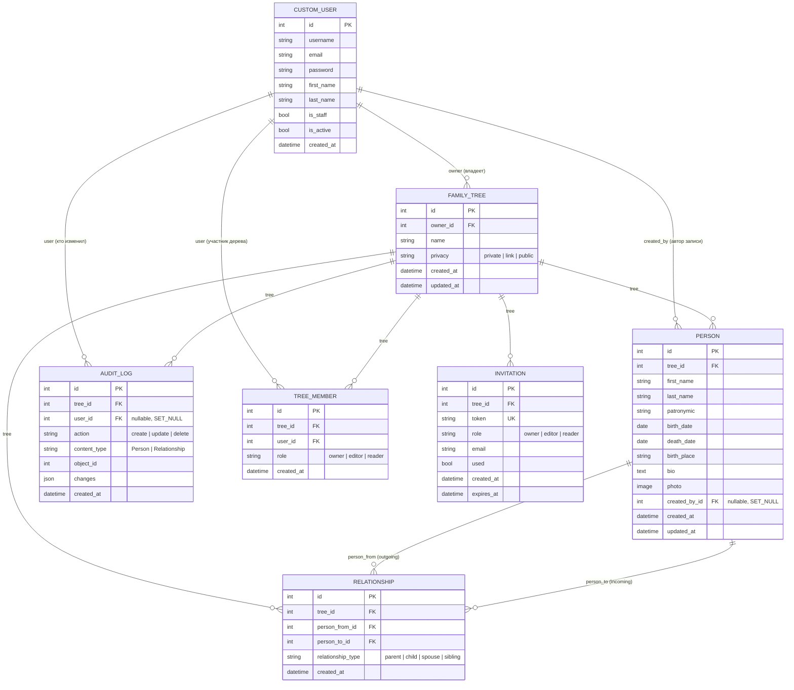

# ER-диаграмма базы данных (FamilyTree backend)

Сгенерировано по фактическим моделям Django (`users/models.py`, `trees/models.py`, состояние на 2026-07-01, после добавления `TreeMember` в миграции `trees.0002_treemember`).
Открывается как обычный Mermaid-диаграмма — GitHub, GitLab и VS Code (расширение Markdown Preview Mermaid) рендерят её автоматически.

## Пояснения к связям

- **CustomUser → FamilyTree** (1 ко многим): `owner` — исторический "главный" владелец дерева (нужен, например, чтобы знать, кого нельзя разжаловать). Реальный доступ и права теперь определяются через `TreeMember`, а не напрямую через это поле.
- **TreeMember** — таблица доступа: кто из пользователей состоит в каком дереве и с какой ролью (`owner/editor/reader`). `unique_together(tree, user)` — у пользователя одна роль на дерево. При создании дерева владельцу автоматически создаётся запись с `role=owner`; при принятии инвайта (`accept_invite`) создаётся/обновляется запись с ролью из инвайта. Все вьюсеты (`FamilyTreeViewSet`, `PersonViewSet`, `RelationshipViewSet`) фильтруют доступ через эту таблицу, а не через `owner`.
- **FamilyTree → Person / Relationship / AuditLog / Invitation / TreeMember** (1 ко многим): всё живёт внутри дерева, при удалении дерева каскадно удаляется (`on_delete=CASCADE`).
- **Person → Relationship**: связь моделируется как направленное ребро графа (`person_from` → `person_to`) с типом (`parent/child/spouse/sibling`), а не как обычное дерево через `parent_id`. Это позволяет хранить супругов/братьев-сестёр, но требует ручной логики построения иерархии на бэкенде или фронте.
- Уникальность `(person_from, person_to, relationship_type)` не даёт задублировать одну и ту же связь.

## Известные пробелы в модели (см. также TODO в коде)

Закрыто (2026-07-01, миграция `trees.0002_treemember`): роли `editor`/`reader` теперь реально дают/ограничивают доступ через `TreeMember`; `accept_invite` выдаёт доступ, а не просто гасит токен; `RelationshipViewSet` и `PersonViewSet` проверяют членство в дереве, а не только `tree_id` из URL.

Осталось не реализовано:

1. **ТЗ упоминает JSONB для гибких анкетных полей** — в текущей модели `Person` все поля жёстко заданы (first_name, last_name и т.д.), JSONB-поля для произвольных атрибутов не предусмотрены.
2. **Нет модели для timeline-событий** (п. 2.3 ТЗ — "хронология жизни") — сейчас есть только `bio` (текстовое поле) и `photo` (одно фото на человека), а не набор архивных фото/документов на профиль.
