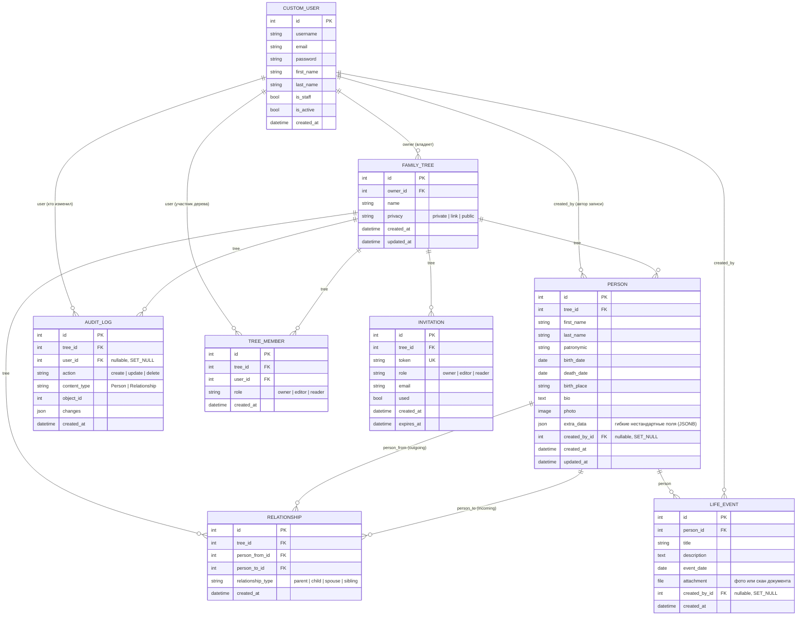

# ER-диаграмма базы данных (FamilyTree backend)

Сгенерировано по фактическим моделям Django (`users/models.py`, `trees/models.py`, состояние на 2026-07-01, после миграций `trees.0002_treemember` и `trees.0003_person_extra_data_lifeevent`).
Открывается как обычный Mermaid-диаграмма — GitHub, GitLab и VS Code (расширение Markdown Preview Mermaid) рендерят её автоматически.

## Пояснения к связям

- **CustomUser → FamilyTree** (1 ко многим): `owner` — исторический "главный" владелец дерева (нужен, например, чтобы знать, кого нельзя разжаловать). Реальный доступ и права теперь определяются через `TreeMember`, а не напрямую через это поле.
- **TreeMember** — таблица доступа: кто из пользователей состоит в каком дереве и с какой ролью (`owner/editor/reader`). `unique_together(tree, user)` — у пользователя одна роль на дерево. При создании дерева владельцу автоматически создаётся запись с `role=owner`; при принятии инвайта (`accept_invite`) создаётся/обновляется запись с ролью из инвайта. Все вьюсеты (`FamilyTreeViewSet`, `PersonViewSet`, `RelationshipViewSet`) фильтруют доступ через эту таблицу, а не через `owner`.
- **FamilyTree → Person / Relationship / AuditLog / Invitation / TreeMember** (1 ко многим): всё живёт внутри дерева, при удалении дерева каскадно удаляется (`on_delete=CASCADE`).
- **Person → Relationship**: связь моделируется как направленное ребро графа (`person_from` → `person_to`) с типом (`parent/child/spouse/sibling`), а не как обычное дерево через `parent_id`. Это позволяет хранить супругов/братьев-сестёр, но требует ручной логики построения иерархии на бэкенде или фронте.
- Уникальность `(person_from, person_to, relationship_type)` не даёт задублировать одну и ту же связь.
- **Person.extra_data** (JSONField → в Postgres это колонка `jsonb`): гибкое хранилище нестандартных анкетных полей (профессия, национальность и т.п.), которые не у каждой семьи одинаковые. Не требует миграции при добавлении нового произвольного поля.
- **Person → LifeEvent** (1 ко многим): хронология жизни — отдельная таблица, а не поле в `Person`. Это намеренно: `full_tree` (граф для фронтенда) отдаёт только компактный `PersonSerializer` без событий, а `LifeEvent` подгружается отдельным запросом `GET /api/trees/{tree_id}/persons/{person_id}/life-events/` — так соблюдается требование ТЗ про ленивую загрузку детальной информации о профилях (п. 3.1).

## Известные пробелы в модели (см. также TODO в коде)

Закрыто (2026-07-01):
- миграция `trees.0002_treemember` — роли `editor`/`reader` теперь реально дают/ограничивают доступ через `TreeMember`; `accept_invite` выдаёт доступ, а не просто гасит токен; `RelationshipViewSet` и `PersonViewSet` проверяют членство в дереве, а не только `tree_id` из URL.
- миграция `trees.0003_person_extra_data_lifeevent` — добавлено JSONB-поле `Person.extra_data` и модель `LifeEvent` (хронология жизни с вложением фото/документа).

Осталось не реализовано (сознательно не входило в этот заход):
- Общая медиа-галерея на персону (несколько архивных фото вне привязки к конкретному событию) — сейчас есть только `Person.photo` (одно фото) и по одному вложению на каждое `LifeEvent`.
- N+1 / рекурсивные CTE (п. 3.1 ТЗ) — отдельная задача по оптимизации запросов, не связанная со схемой данных.
